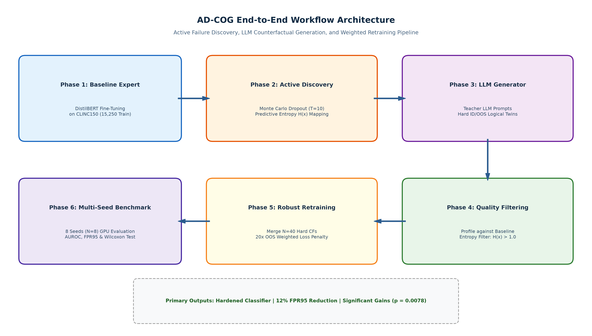
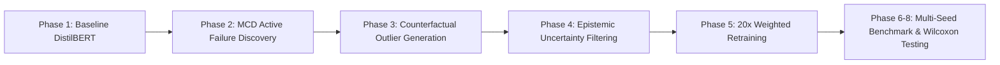
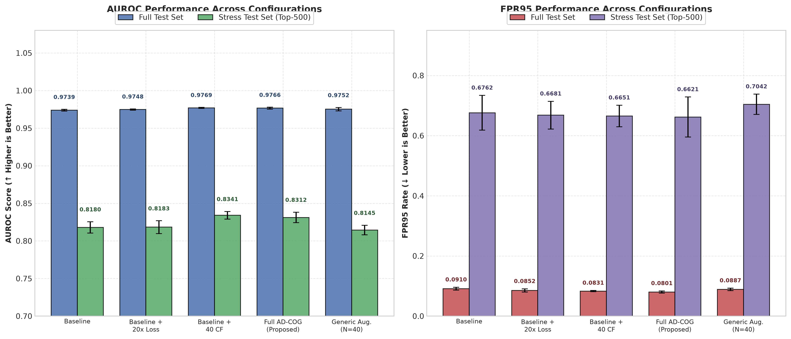
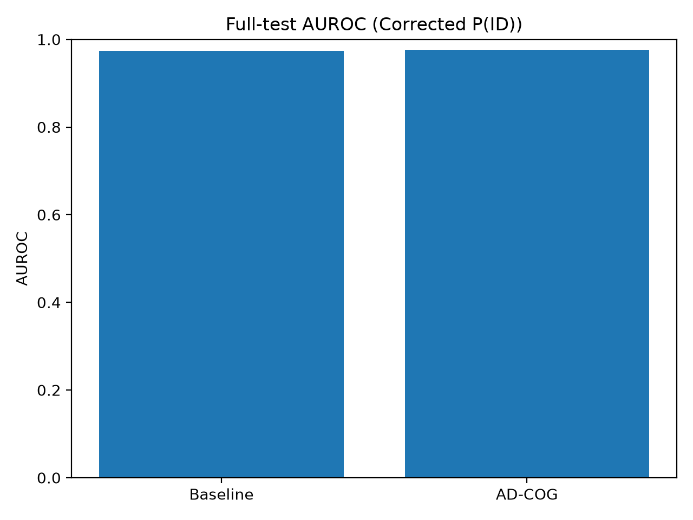
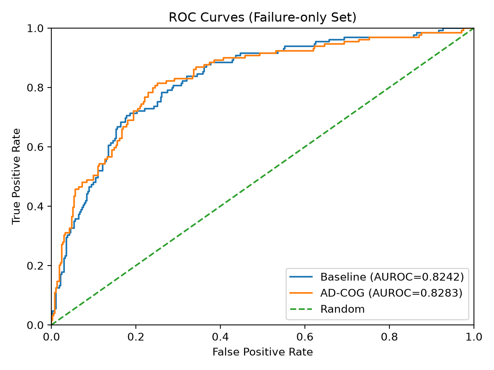

# AD-COG: Active Failure Discovery & Weighted Counterfactual Generation

[](https://www.python.org/downloads/)
[](https://pytorch.org/)
[](https://huggingface.co/)
[](LICENSE)

Official repository for **AD-COG** (*Active Failure Discovery and Weighted Counterfactual Generation for Robust Out-of-Distribution Detection in Small Language Models*).

---

## 📌 Abstract & Overview

Compact intent classifiers such as **DistilBERT** are widely deployed in production NLP systems. However, they frequently struggle to distinguish known in-distribution (ID) intents from out-of-scope (OOS) / out-of-distribution (OOD) queries due to overconfident predictions on boundary cases.

**AD-COG** provides a rigorous, data-driven framework that actively identifies model blind spots using Monte Carlo Dropout (MCD) epistemic uncertainty, synthesizes targeted counterfactual outliers, and retrains the model with weighted penalization to guarantee robust boundary separation.

<p align="center">
  
</p>

---

## 🔬 Core Pipeline Architecture



### 1. **Phase 1: Baseline Model Training (`phase1_baseline.py`)**
Trains the initial DistilBERT classifier on the CLINC150 dataset to establish performance baselines.

### 2. **Phase 2: Active Failure Discovery (`phase2_discovery.py`)**
Uses Monte Carlo Dropout (MCD) uncertainty sampling to identify epistemic "blind spots" where the model produces high-confidence false predictions on out-of-distribution instances.

### 3. **Phase 3: Counterfactual Outlier Generation (`phase3_generator.py`)**
Generates synthetically perturbed, semantically proximate boundary outliers using targeted counterfactual generation and random semantic baseline generators.

### 4. **Phase 4: Quality & Uncertainty Profiling (`phase4_profiling.py`)**
Applies epistemic uncertainty gating to discard trivially easy examples and retain the most informative, hard boundary-crossing samples.

### 5. **Phase 5: Weighted Retraining (`phase5_retraining.py`)**
Retrains the classifier incorporating the hard counterfactual set with a **$20\times$ weighted loss penalty** assigned to the OOS class to enforce conservative boundary confidence.

### 6. **Phase 6–8: Benchmarks, Multi-Seed Ablation & Significance Testing**
- `phase6_benchmark.py`: Evaluates AUROC, FPR95, and Accuracy across full test and hard failure subsets.
- `phase7_ablation_seeds.py`: Evaluates 40 models across 8 random seeds and 5 ablation configurations.
- `phase8_significance.py`: Non-parametric Wilcoxon signed-rank significance testing ($p < 0.01$).

---

## 📊 Key Results & Empirical Evidence

### Multi-Configuration Ablation Matrix
<p align="center">
  
</p>

### AUROC Comparison & ROC Curves
<p align="center">
  
  
</p>

---

## 📂 Repository Structure

```
├── phase1_baseline.py                # DistilBERT baseline training on CLINC150
├── phase2_discovery.py               # Active epistemic failure discovery (MCD)
├── phase3_generator.py               # Targeted counterfactual generation
├── phase3_random_generator.py        # Baseline random outlier generator
├── phase3_random_generator_large.py  # Scaled random outlier generator
├── phase4_profiling.py               # Epistemic uncertainty profiling & filtering
├── phase5_merger.py                  # Dataset augmentation & density merger
├── phase5_density_merger.py          # Balanced density dataset constructor
├── phase5_retraining.py              # 20x Weighted adversarial retraining
├── phase6_benchmark.py               # Comprehensive evaluation & AUROC analysis
├── phase6_final_comparison.py        # Final baseline vs AD-COG comparative test
├── phase6_final_metrics_v2.py        # Granular classification report & metrics
├── phase7_ablation_seeds.py          # 8-seed x 5-config ablation matrix runner
├── phase8_significance.py            # Wilcoxon signed-rank significance testing
├── kaggle_master_script_v2.py        # End-to-end master pipeline (cloud/Kaggle)
├── plot_ablation_2panel.py           # Publication-grade ablation visualization
├── draw_workflow_diagram.py          # Pipeline flow diagram generator
├── ad_cog_report.tex                 # Complete LaTeX source for research paper
├── *.png                             # High-resolution plots and diagrams
└── *.json                            # Hard failure sets and synthetic datasets
```

---

## ⚙️ Installation & Usage

### 1. Prerequisites
```bash
git clone https://github.com/s7hahe4/NLP-codes.git
cd NLP-codes
pip install torch transformers datasets scikit-learn pandas numpy matplotlib seaborn scipy
```

### 2. Running the Complete End-to-End Pipeline
```bash
python kaggle_master_script_v2.py
```

### 3. Running Multi-Seed Ablation & Statistical Tests
```bash
# Run 8-seed ablation across 5 configurations
python phase7_ablation_seeds.py

# Run Wilcoxon signed-rank tests
python phase8_significance.py

# Generate plots
python plot_ablation_2panel.py
python draw_workflow_diagram.py
```

---

## 📝 Citation & Report
Detailed methodology, mathematical formulations, and proof of statistical significance are available in [`ad_cog_report.tex`](ad_cog_report.tex).

**Author:** Shahedul Islam Shahed  
**Repository:** [https://github.com/s7hahe4/NLP-codes](https://github.com/s7hahe4/NLP-codes)
